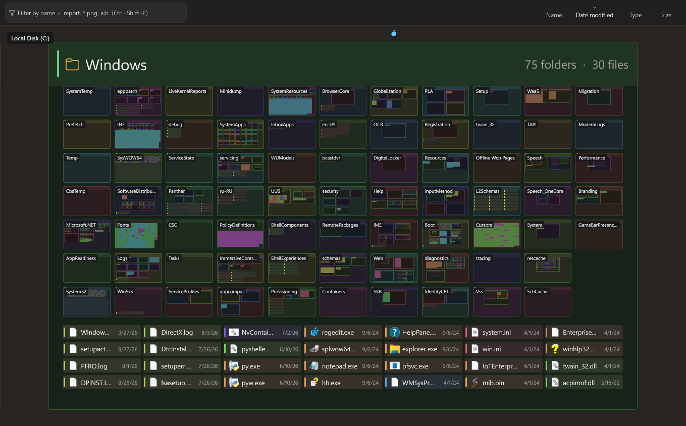

# UltraExplorer

A file manager for Windows that shows your whole disk as one zoomable picture.

Every folder is a cell drawn inside its parent, with its sub-folders and files
inside it, so the entire This PC fits on one screen and "opening" a folder is
just zooming into it. It keeps the Windows 11 File Explorer shell around the
canvas — address bar, navigation pane, the real Shell context menus — so it
works like the Explorer you know, with a map of everything underneath.



## Features

- **The whole disk on one canvas.** Folders nest inside folders; zoom to any
  depth without losing your place. Nothing is read up front — a folder is read
  the moment it is drawn large enough to matter.
- **Drawn by the GPU.** Direct3D 11 draws every cell and file tile as an
  instance of one mesh, icons come from one texture atlas, and names from an
  SDF glyph atlas, so zooming stays smooth on a 4K screen. A CPU renderer takes
  over where there is no GPU (remote desktop, software rendering).
- **Sorting like Explorer.** Name, Date modified, Type, Size — ascending or
  descending — with Explorer-style column headers. Each folder remembers its own
  order; grids fill top to bottom, then across (switchable). File tiles show the
  value they are sorted by: size, date or type.
- **Selection.** Drag a marquee inside a folder, Shift+click a range, Ctrl+click
  to toggle, Shift+arrows, Ctrl+A. The canvas and the folder list share one
  selection, and copy, cut, delete, drag-and-drop and the context menu act on
  all of it.
- **Split view.** Two panes side by side or stacked (Ctrl + \\), like the split
  network editor in Houdini. Each is a whole canvas at its own place on the
  disk, with its own camera, selection, filter, sort headers and Back/Forward,
  and a path bar naming its folder. Drag files from one onto a folder of the
  other, copy or move the selection to the other pane with Shift + F5 /
  Shift + F6, or open a folder there from its menu; F6 switches panes.
- **Live.** Every change on disk shows up on the canvas and in the list within a
  moment — one watcher per volume, not per folder.
- **Find things on a huge map.** Colour marks, notes and pins stay visible as
  beacons at any zoom, with arrows at the edge for what is off screen. A name
  filter (`report`, `*.png`, `a;b`) lights up matches.
- **Search every drive, this folder first.** Results appear as you type, what
  is in the folder you are in on top, then everything else; exact names first,
  `node_modules` and caches last. They stay up while you move around the
  canvas: ↑↓ to walk them, Enter to show one, Ctrl+Enter to open. Instant with
  [Everything](https://www.voidtools.com/) running (no DLL needed); without it
  the drives are walked.
- **Layers.** Hide files to see only the folder structure, or turn off icons,
  details, counts, hidden items and marks.
- **A tree canvas too.** Switch to a node-graph view of the same folders at any
  time (Settings → View).
- **Replaces the Open/Save dialog** for programs that ask for it (see
  [BUILD.md](BUILD.md#file-dialog-mode)).

## Install

**Installer:** download
[`UltraExplorer-Setup-x64.exe`](../../releases/latest/download/UltraExplorer-Setup-x64.exe)
from the [latest release](../../releases/latest) and run it. It installs for
you alone, without administrator rights, into
`%LOCALAPPDATA%\Programs\UltraExplorer` (or for all users, if you choose so),
adds UltraExplorer to the Start menu and to Apps → Installed apps, and updates
an earlier copy in place. No .NET install needed.

**Portable:** grab
[`UltraExplorer-win-x64.zip`](../../releases/latest/download/UltraExplorer-win-x64.zip),
unzip it anywhere and run `UltraExplorer.exe`. It is a single self-contained
file.

**From source** (Windows 10 1903+ / 11, x64, [.NET 10 SDK](https://dotnet.microsoft.com/download)):

```powershell
git clone <this repository>
cd UltraExplorer
powershell -ExecutionPolicy Bypass -File scripts/install.ps1 -Launch
```

That builds a Release copy into `%LOCALAPPDATA%\Programs\UltraExplorer` and adds
an **UltraExplorer** shortcut to the Start menu, so Windows Search and launchers
find it. Run it again to update. Settings live in `%LOCALAPPDATA%\UltraExplorer`.

## Using it

| | |
|---|---|
| Zoom | Ctrl + wheel, or the + / − buttons |
| Move around | Right or middle drag, Space + drag, wheel / Shift + wheel |
| Open a folder | Double-click it (the canvas flies into it) |
| Select | Click, Ctrl + click, Shift + click, or drag a marquee in a folder's open space |
| Everything / the selection | Shift + 1 / Shift + 2 |
| Search every drive | Ctrl + F, then ↑↓, Enter to show, Ctrl + Enter to open, Esc |
| Filter by name | Ctrl + Shift + F |
| Split view / stacked | Ctrl + \\ / Ctrl + Shift + \\, or the split button; drag the divider to resize |
| Switch panes | F6, or click in a pane |
| Copy / move to the other pane | Shift + F5 / Shift + F6, or drag onto a folder there |
| Settings | the gear, or Ctrl + , |

Right-click a folder's open space for its own menu: sort this folder, colour,
note, pin, properties, open in the other pane. Items get Copy and Move to
other pane below the Windows menu while the view is split.

## Build and test

See [BUILD.md](BUILD.md): building, the headless test harness (`ViewAllSmoke`,
about 2,100 checks), the benchmark and snapshot switches, and a self-contained
publish. [PROJECT_HANDOFF.md](PROJECT_HANDOFF.md) describes how it works inside
(in Russian).

## License

[MIT](LICENSE) — use it, change it, ship it, commercially or not.
