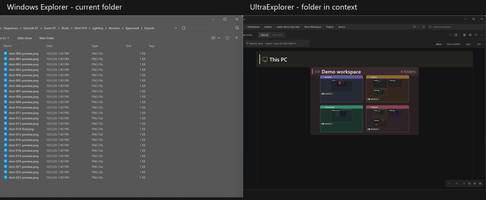
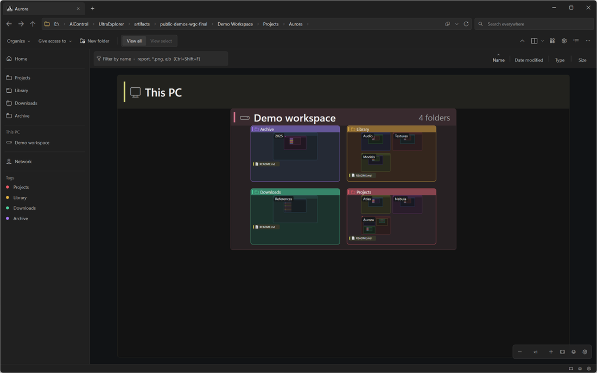
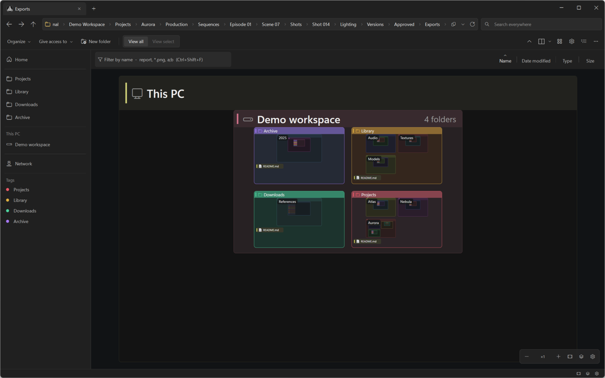
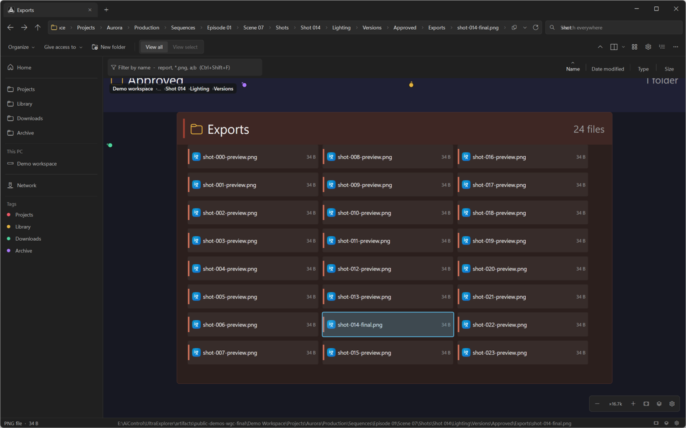
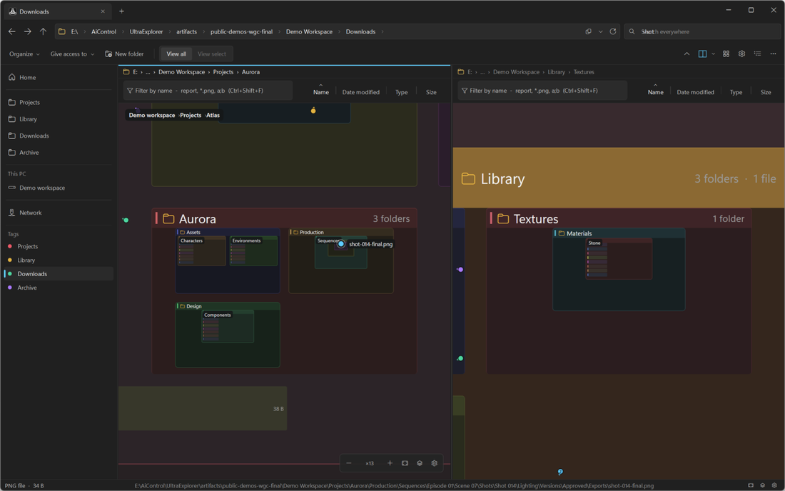

<div align="center">

# UltraExplorer

### Your files. One zoomable map.

A native Windows file manager that turns your folder hierarchy into a canvas.
See the structure, fly into a folder, and keep your bearings.

[](https://github.com/So2K/UltraExplorer/actions/workflows/release.yml)
[](https://github.com/So2K/UltraExplorer/releases)
[](src/UltraExplorer/UltraExplorer.csproj)
[](LICENSE)

[Download for Windows](https://github.com/So2K/UltraExplorer/releases/latest) ·
[Watch the demos](#see-it-in-action) ·
[Build from source](BUILD.md) ·
[Русский](docs/README.ru.md)


[GIF version](docs/media/overview.gif)

</div>

You remember roughly where something lives: a project inside a client folder,
an export beside its source, a reference tucked several levels down. UltraExplorer
makes that structure visible. Every drive is a root; folders and files sit
inside their parents. Opening a folder moves the camera into it.

The address bar, navigation pane, file operations and Windows Shell menus
remain familiar. The canvas gives you another way to find and move your files.

## Same folder, two views

| Navigation | Windows Explorer | UltraExplorer |
| --- | --- | --- |
| Move through a hierarchy | Enter directories as the current folder view changes. | Fly into nested folders on one map. |
| Keep your bearings | Breadcrumbs, Back/Forward and the navigation pane. | The same path navigation, plus the surrounding folder structure. |
| Return to a project | Pinned locations in the navigation pane. | Favorites, color Tags and visual marks on the canvas. |



[GIF version](docs/media/explorer-comparison.gif)

Left: native Windows Explorer's Details view, already in the destination
folder. Right: UltraExplorer flying from the overview to that same folder,
then to Library and back. The destination is 12 directory levels below the
generated workspace. Both apps can open a pasted path. This compares the
views, with no artificial disk delay or timing race.

## See it in action

These 30 fps animated PNG demos were captured from the running app with
Windows Graphics Capture, using the CPU fallback and a preloaded, generated
workspace. Playback follows elapsed frame timestamps. GIF alternatives are
linked under each clip.

### Go deep without losing the bigger picture

Double-click a folder to fly into it. Zoom back out to see its siblings and
parents, or paste a path to jump straight there. Directory contents load as
they become visible. Cold directories and network paths depend on filesystem
response time.



[GIF version](docs/media/deep-zoom.gif)

### Search, then land on the result

Press `Ctrl+F` to search across drives. Results in and below your current folder
come first. Select a result to reveal its place on the map; `Ctrl+Enter` opens
it in its default application.

[Everything](https://www.voidtools.com/) is recommended for indexed global
search. UltraExplorer talks to the running application directly, with no SDK
DLL to install. Without Everything it walks directories in the background,
and results arrive as that walk progresses. Index coverage and disk access
determine what can be found.



[GIF version](docs/media/search.gif)

The search recording uses a background directory walk scoped to the demo
workspace.

### Remember folders by color

Give a folder a color and it appears in **Tags**, below **Network** in the
navigation pane. Use the compact list when you know the color, or find the
same mark on the canvas. Click a tag to go to its folder.

Right-click a tag for **Change color** or **Unpin**. Unpin removes its color
and sidebar entry while keeping its note. `Shift+F10` and the Menu key work
too. Colors and notes belong to paths and are shared between app windows.



[GIF version](docs/media/tags.gif)

### Work in two places at once

Split the canvas side by side or top to bottom. Each pane keeps its own
camera, selection, filter and history. Drag a file onto a folder in the other
pane, or use `Shift+F5` to copy and `Shift+F6` to move the selection there.



[GIF version](docs/media/split-view.gif)

## What you can do

| Feature | How it helps |
| --- | --- |
| Nested canvas | See folders inside folders, with each drive as a root. Switch to a tree canvas in Settings → View. |
| Native GPU rendering | A C#/.NET 10 Windows app: WPF for the shell, Direct3D 11 for the nested canvas, with a CPU fallback. |
| Familiar file operations | Open, copy, cut, paste, rename, duplicate, delete, recycle, properties and drag-and-drop. |
| Windows context menus | Use installed Shell actions and extensions for files and folders. Mixed-parent selections use the app's menu. |
| Selection and sorting | Marquee, Ctrl/Shift selection, shared canvas/list selection, and per-folder Name, Date modified, Type or Size order. |
| Visual landmarks | Colors, notes and pins; canvas beacons help locate marks outside the current view. |
| Local name filter | Highlight names and wildcard matches in loaded branches without rearranging the map. |
| Layers | Hide files, icons, details or marks to focus on the structure you need. |

The map shows **directory structure**, not storage usage: sibling folder cells
have equal sizes. It is useful for navigating a hierarchy, rather than judging
which folder occupies the most bytes.

## Download

The current stable-channel release is **v1.2.0 for Windows x64**. Get the assets from
[v1.2.0](https://github.com/So2K/UltraExplorer/releases/tag/v1.2.0):

- [Installer — UltraExplorer-Setup-x64.exe](https://github.com/So2K/UltraExplorer/releases/download/v1.2.0/UltraExplorer-Setup-x64.exe): installs into `%LOCALAPPDATA%\Programs\UltraExplorer`, adds a Start menu entry and an uninstaller.
- [Portable — UltraExplorer-win-x64.zip](https://github.com/So2K/UltraExplorer/releases/download/v1.2.0/UltraExplorer-win-x64.zip): extract it and run `UltraExplorer.exe`.

Both include the .NET runtime. Settings, favorites, colors and notes are stored
in `%LOCALAPPDATA%\UltraExplorer`.

Windows 11, x64. For earlier and newer builds, see
[all releases](https://github.com/So2K/UltraExplorer/releases).

[Release notes and validation limits](docs/RELEASE_NOTES_v1.2.0.md).

## What changed in v1.2.0

This release integrates all 18 saved review work packages and additional
cross-file corrections. The focus is predictable navigation and file actions:

- Safer drag-and-drop handoffs and selection when a folder disappears outside the app.
- Earlier folder-window restoration, guarded Explorer handoffs and steadier arrow-key navigation.
- Shared Tags and notes, camera continuity through renames, and filters that follow visibility changes.
- Independent split-pane transfers, stale-row interaction guards and prompts that disable only their owner.
- Background file-command preparation, streamed search-row reuse and cached visual landmarks.

The release-channel label does not mean every review finding or regression
check is closed. The notes record the tested scope and remaining failures.

## A few keys to get started

| Action | Shortcut |
| --- | --- |
| Zoom toward the pointer | `Ctrl+wheel` |
| Pan | Middle/right drag, `Space+drag`, wheel / `Shift+wheel` |
| Enter a folder / open a file | Double-click |
| Fit the whole map / selected item | `Shift+1` / `Shift+2` |
| Type or paste a path | `Ctrl+L` or `Alt+D` |
| Search across drives | `Ctrl+F` |
| Reveal / open a search result | `Enter` / `Ctrl+Enter` |
| Filter loaded names | `Ctrl+Shift+F` |
| Split side by side / stacked | `Ctrl+\` / `Ctrl+Shift+\` |
| Switch panes | `F6` |
| Copy / move to the other pane | `Shift+F5` / `Shift+F6` |
| Settings | `Ctrl+,` |

Standard Explorer keys such as `Ctrl+C`, `Ctrl+X`, `Ctrl+V`, `F2`, `Delete`,
`Alt+Left` and `Alt+Up` work too.

## Optional Windows integration

Start with UltraExplorer as a standalone file manager. In Settings you can
enable folder-opening integration, supported Open/Save/folder dialogs, and
the separate `Win+E` preference. Fresh installations leave these off.

Unsupported virtual locations, inaccessible dialogs and custom controls can
remain with Windows. The dialog footer offers **Use the Windows dialog this
time**; Settings provides **Restore and pause**.

See [Explorer integration](docs/EXPLORER_REPLACEMENT.md),
[dialog integration](docs/DIALOG_INTEGRATION.md) and the
[picker API](PICKER.md) for coverage, recovery and application integration.

## Current limits

- **View select** is reserved and disabled; **View all** is implemented.
- The name filter covers loaded branches. Use global search for an unvisited path.
- Large directories can use capped canvas listings. The canvas is not a complete disk index.
- Open/Save integration does not support every application or Shell namespace.
- Windows Shell can reject a recursive folder duplicate whose destination tree is too long. The app reports a clear error; shorten names or move the tree closer to a drive root.
- The tree canvas rebuilds node objects on refresh. A concurrent reveal's returned reference can become stale after an ancestor refresh; its exact return-time validity remains under investigation.
- GPU presentation still waits for completion on the shared UI thread. A nonblocking presentation pipeline remains a separate renderer task.

## Build and contribute

On Windows x64 with the [.NET 10 SDK](https://dotnet.microsoft.com/download):

```powershell
git clone https://github.com/So2K/UltraExplorer.git
cd UltraExplorer
dotnet build UltraExplorer.sln -c Release
dotnet run --project src/UltraExplorer/UltraExplorer.csproj -c Release
```

[BUILD.md](BUILD.md) covers publishing, the smoke harnesses, GPU checks and
reproducible canvas benchmarks. The [rendering review](docs/RENDERING_ZOOM_REVIEW.md)
explains the renderer and its measured checks. Performance depends on the
machine, directory contents and cache state; recorded demos are examples,
not benchmarks.

Useful contributions include keyboard and accessibility polish, reproducible
edge cases, documentation and translations. For a first contribution, choose
one focused issue: name the exact interaction, describe the expected result,
and include a small reproduction. Look for
[good first issues](https://github.com/So2K/UltraExplorer/issues?q=is%3Aissue%20is%3Aopen%20label%3A%22good%20first%20issue%22),
or [open an issue](https://github.com/So2K/UltraExplorer/issues/new) to discuss it.

Development priorities:

- Make navigation, selection and file operations predictable across keyboard,
  mouse, DPI settings and large directories.
- Broaden real-world coverage for removable drives, offline paths and Windows
  integration.
- Improve search feedback and discoverability of visual landmarks.
- Define **View select** before implementing its interaction model.

If the idea is useful to you, star the repository and share a workflow or a
problem it should solve. Specific feedback helps shape the next release.

## License

[MIT](LICENSE). Third-party components and references are listed in
[THIRD-PARTY-NOTICES.md](THIRD-PARTY-NOTICES.md).
